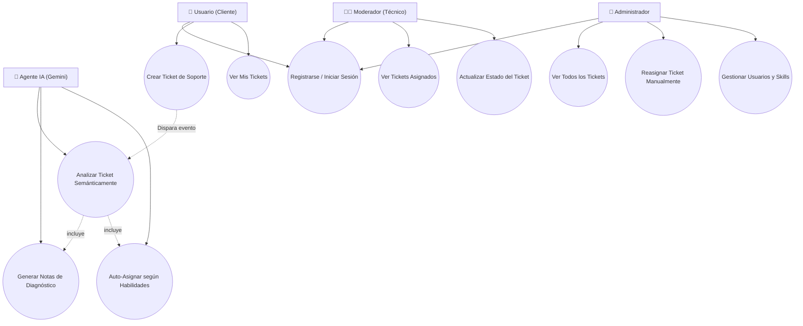
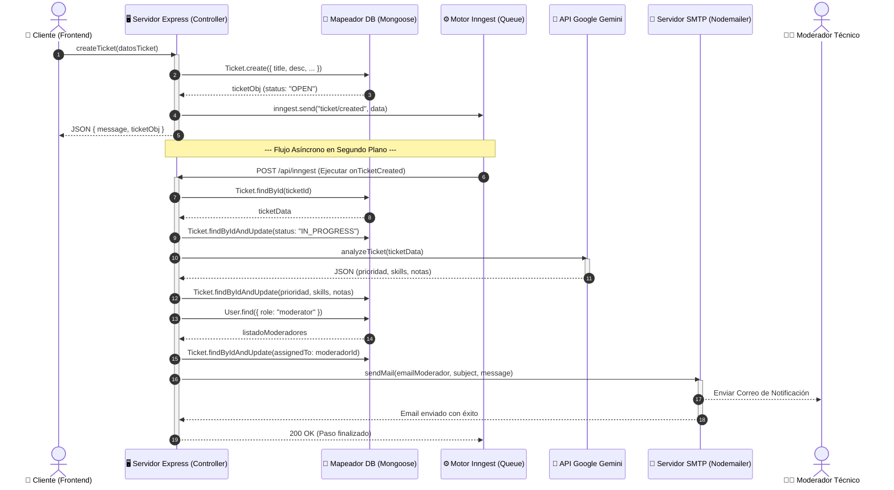
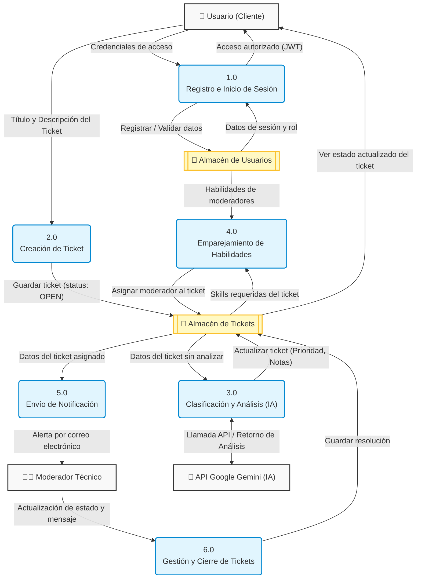

# Reporte Técnico y Documentación del Proyecto: SmartTicket AI

Este documento contiene la descripción completa, arquitectura, requerimientos, alternativas de diseño y plan de pruebas de la plataforma **SmartTicket AI**.

---

## 1. Nombre del Proyecto y Esencia
*   **Nombre Comercial:** **SmartTicket AI** (o **SmartTicket.AI**)
*   **Frase descriptiva:** *“Plataforma inteligente de soporte técnico con análisis y asignación de incidencias optimizada por IA.”*

---

## 2. Antecedentes y Descripción General
El tema central sobre el cual se construye este sistema es la **gestión de soporte técnico de tecnologías de la información (ITSM - *IT Service Management*) y la atención al cliente**. 

### Relación de SmartTicket AI con el tema:
**SmartTicket AI** surge como una solución moderna a los cuellos de botella del triaje manual mediante la **automatización inteligente e impulsada por eventos**. En el instante en que un ticket es creado por un usuario, el sistema utiliza IA Generativa (a través de la API de **Google Gemini**) y flujos de trabajo asínconos en segundo plano (con **Inngest**) para deducir de forma autónoma la prioridad del ticket, extraer las habilidades técnicas requeridas, sugerir notas de diagnóstico al moderador asignado, y enrutar la tarea de inmediato al técnico correspondiente.

### 2.2 Objetivos del sistema
*   **Idea del sistema:** Automatizar el ciclo de vida de los tickets de soporte.
*   **Cliente:** Departamentos de soporte técnico de TI y empresas de atención al cliente.
*   **Valor ofrecido:** Eliminación del triaje manual, asignación automática del ticket al técnico idóneo y reducción drástica del tiempo de resolución.

---

## 3. Resumen de la Situación Actual del Mercado (Problemas existentes)
*   **Jira Service Management:** Robusto, pero la asignación inteligente avanzada requiere reglas manuales complejas o plugins de pago externos.
*   **Zendesk:** Excelente soporte omnicanal, pero sus herramientas de IA avanzada están limitadas a tarifas corporativas costosas.
*   **Triaje Manual (Excel/WhatsApp):** Proceso propenso a errores de asignación, lentitud extrema y nula capacidad de escala.

---

## 4. Innovación y Mejoras del Proyecto
*   **Diagnóstico asistido inmediato:** La IA analiza el problema y sugiere notas de resolución técnica al moderador antes de que comience a trabajar.
*   **Asignación inteligente nativa:** Emparejamiento asíncrono y automático basado en el análisis semántico de habilidades (*skills*) del ticket versus el perfil del moderador, integrado directamente en el flujo de la aplicación.

---

## 5. Requisitos del Sistema y Funcionalidad

### 5.1 Requisitos del sistema (Entorno de implementación y uso)
*   **Backend:** Node.js (Express), MongoDB (Atlas para persistencia / In-Memory local) e Inngest (gestor de colas de eventos en segundo plano).
*   **Frontend:** React (Vite) y CSS moderno (Tailwind) corriendo en navegadores web.
*   **Rendimiento:** Uso de colas de tareas con reintentos automatizados (Inngest) para aislar fallos del servidor y soportar picos de carga de eventos sin perder tickets.

### 5.2 Requisitos funcionales
*   **Módulo de Autenticación:** Registro e inicio de sesión seguro diferenciando roles (Admin, Moderador, Usuario).
*   **Módulo de Creación de Tickets (Usuario):** Crear y listar incidencias técnicas.
*   **Módulo AI Agent (Segundo plano):** Categorización automática, priorización de severidad y asignación inteligente del ticket.
*   **Módulo de Panel de Control (Moderador/Admin):** Modificar estados del ticket (`OPEN`, `IN_PROGRESS`, `RESOLVED`, `CLOSED`), reasignar agentes y enviar respuestas finales.

---

## 6. Problemas Esperados y Soluciones (Operativos y Tecnológicos)
1.  **Límites de cuota de la IA (Rate Limits):** Bloqueo de peticiones si se crean demasiados tickets al mismo tiempo usando la API gratuita de Gemini.
    *   *Solución:* Configuración de reintentos asíncronos y espaciados (*backoff exponencial*) nativos en Inngest ante respuestas de error HTTP 429 de Gemini.
2.  **Pérdida de datos local:** Al correr con base de datos en memoria por fallas de red con Atlas, los datos se borran al reiniciar el servidor.
    *   *Solución:* Uso de una conexión Atlas con redundancia en la nube, y logs locales persistentes en archivos de texto de desarrollo.
3.  **Falta de confianza del equipo técnico:** Resistencia de los moderadores a aceptar las asignaciones y diagnósticos sugeridos por la IA.
    *   *Solución:* Flujo híbrido de validación que permite a los administradores humanos modificar y reescribir manualmente la prioridad y la asignación sugerida por la IA.

---

## 7. Solución Tecnológica Seleccionada

### 7.1 Topología del sistema
*   **Arquitectura de 3 Capas:** Cliente SPA (React) consume servicios de Backend API (Express), coordinado con el motor de colas Inngest para ejecutar tareas en segundo plano. Los datos se persisten en MongoDB Atlas.

### 7.2 Tecnologías en uso
*   **React + Vite:** Construcción ágil y modular de componentes con Virtual DOM.
*   **Express (Node.js):** Creación ágil de una API REST liviana.
*   **Inngest SDK:** Automatización de flujos de trabajo asíncronos basados en eventos.
*   **Mongoose:** Modelador ODM estructurado de esquemas MongoDB.

### 7.3 Lenguajes de desarrollo
*   **TypeScript (Frontend):** Seguridad mediante tipado estático en la interfaz de usuario.
*   **JavaScript ES6+ (Backend):** Rapidez de desarrollo e integración de APIs.

### 7.4 Arquitectura elegida (¿Por qué?)
*   **Arquitectura Dirigida por Eventos (EDA) + Cliente-Servidor:** Al desacoplar la creación del ticket del análisis de IA (que puede tomar varios segundos), el usuario no experimenta bloqueos en el navegador.

### 7.5 División en programas y módulos
*   **Módulo de Autenticación:** Registro, login y protección de rutas con JWT.
*   **Módulo de Gestión de Tickets:** CRUD de tickets de soporte.
*   **Módulo AI Agent:** Análisis y clasificación semántica mediante Gemini.
*   **Módulo de Notificación:** Notificación por correo mediante SMTP.

### 7.6 Entorno del servidor
*   **Servidor Web:** Local (desarrollo, puerto 5000) / Plataformas PaaS (producción).
*   **Base de datos:** Remota NoSQL en la nube en **MongoDB Atlas**.

### 7.7 Interfaz usuario/cliente - GUI (Pantallas)
*   **Login / Registro:** Acceso seguro según roles.
*   **Listado de Tickets:** Vista centralizada con filtros inteligentes.
*   **Creación de Tickets:** Formulario intuitivo de reporte.
*   **Detalle de Ticket:** Vista del ticket con prioridad, asignación y sugerencias de IA.

### 7.8 Interfaces con otros sistemas / APIs
*   **Google Gen AI API (Gemini):** Evaluación semántica y categorización inteligente.
*   **Servidor SMTP (Mailtrap):** Notificaciones electrónicas a moderadores.

### 7.9 Uso de paquetes de software
*   **BcryptJS:** Encriptación segura de contraseñas.
*   **JSONWebToken (JWT):** Gestión de sesiones sin estado.

---

## 8. Uso de Estructuras de Datos y Organización de Archivos

### 8.1 Estructuras de datos
*   **Objetos JSON (Documentos BSON):** Transporte e inserción estructurada de datos.
*   **Arrays:** Listas de habilidades y prioridades.
*   **Colas FIFO:** Cola de mensajes distribuidos en Inngest.

### 8.2 Método de almacenamiento
*   **MongoDB NoSQL:** Colecciones `users` y `tickets` en la nube.
*   **Archivos físicos:** Fichero `.env` para secretos locales y archivos logs de sistema.

### 8.3 Mecanismos de recuperación y soporte de transacciones
*   **Resiliencia de Inngest:** Recuperación de estado automática en caso de caída del servidor usando reintentos.
*   **Atomicidad:** Actualización atómica en Mongoose con operaciones directas en base de datos.

---

## 9. Diagramas del Sistema Central

### 9.1 Diagrama de Casos de Uso

### 9.2 Diagrama de Secuencia

### 9.3 Diagrama de Flujo de Datos (DFD Nivel 1)

---

## 10. Descripción del Componente Algorítmico

*   **Clasificación e Inferencia Semántica (Procesamiento de Lenguaje Natural):** Utiliza modelos de lenguaje de **Google Gemini** para escanear y traducir texto no estructurado en un objeto JSON con prioridad normalizada y habilidades requeridas (*skills*).
*   **Algoritmo de Emparejamiento Bidireccional (Skills Matcher):** Un algoritmo en Node.js realiza un escaneo bidireccional cruzado en memoria de los perfiles de moderadores, aplicando comparaciones de subcadenas insensibles a mayúsculas y minúsculas (ej. empareja automáticamente un ticket con la skill `"Windows Troubleshooting"` a un moderador con la skill `"Windows"`).

---

## 11. Seguridad y Protección de la Información

*   **Nivel de Aplicación:** Hashing irreversible de contraseñas con **BcryptJS** y autenticación por tokens **JWT** firmados digitalmente.
*   **Nivel de Red:** Tránsito seguro de información mediante cifrado **HTTPS/TLS** en todas las peticiones a la API y llamadas externas de IA.
*   **Nivel de Base de Datos:** Restricción de acceso en MongoDB Atlas por credenciales y lista de IPs autorizadas (*whitelisting*).

---

## 12. Recursos del Proyecto

*   **Horas de Desarrollo:** ~120 horas distribuidas de forma equitativa (~60 horas por integrante para Frontend y Backend).
*   **Hardware:** Computadora de desarrollo estándar.
*   **Software:** Visual Studio Code, MongoDB Compass, Inngest CLI.
*   **Literatura clave:** *"Eloquent JavaScript"* (Marijn Haverbeke) y *"Designing Data-Intensive Applications"* (Martin Kleppmann).

---

## 13. Plan de Trabajo e Implementación
*   **Semana 1:** Planificación, Diseño de Esquemas y wireframes de UI.
*   **Semana 2:** Desarrollo del Backend, API REST e Inngest setup.
*   **Semana 3:** Desarrollo del Frontend en React, consumos e integración.
*   **Semana 4:** Pruebas de integración, corrección de fallos y optimización.

---

## 14. Plan de Pruebas (STP-DOC)

### 14.1 Pruebas de proceso a nivel de usuario (E2E)
*   **Flujo Completo:** Registro de usuario ➡️ Creación de Ticket ➡️ Ejecución Inngest/IA ➡️ Asignación a Moderador ➡️ Envío de email de alerta. *Resultado Obtenido:* Exitoso en 15 segundos.

### 14.2 Pruebas Unitarias
*   **Test AI (`utils/ai.js`):** Valida formato JSON de salida de Gemini.
*   **Test Asignación:** Valida emparejamiento semántico de habilidades.
*   **Test Autenticación:** Impide registro de correos duplicados.

---

## 15. Control de Versiones

*   **Versión 1.0 (MVP):** Autenticación básica y asignación manual humana.
*   **Versión 2.0 (Professional):** Cola de eventos asíncronos y asignación exacta por palabras clave.
*   **Versión 3.0 (Enterprise - SmartTicket AI):** Análisis semántico Gemini AI, sugerencias de diagnóstico, emparejamiento flexible y notificaciones SMTP.
